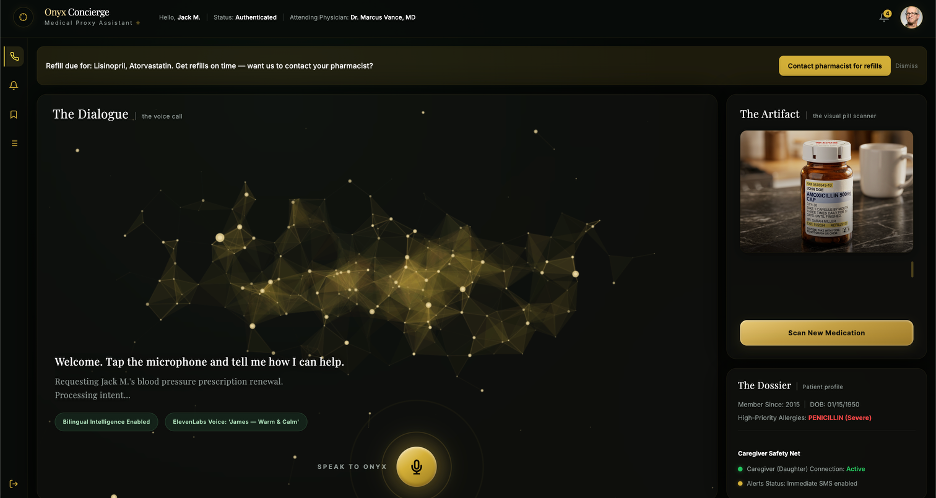

Introducing Onyx,

An autonomous medical proxy that cross-references patient records against live conversations and webcam scans to prevent dangerous drug interactions.



## Core Features

- **Instant Dossier** — Uploads of medical PDFs or images are parsed by **Gemini 2.0 Flash** (via OpenRouter) into a structured patient JSON profile (allergies, current medications, caregiver, demographics).
- **Real-Time Telephony** — A FastAPI backend bridges the web client to a live Twilio voice call using **TwiML `<Gather>` + `<Play>`**, with each turn synthesized by ElevenLabs and served over a public tunnel (or temporary CDN URL) so Twilio can fetch it.
- **Native Voice Synthesis** — ElevenLabs **`eleven_v3`** for in-app TTS and **`eleven_turbo_v2_5`** with `optimize_streaming_latency=3` for telephony, giving low-latency, natural-sounding conversational audio. One voice handles 70+ languages by letting v3 infer accent from the text itself.
- **Autonomous Safety Net (Visual Scanner)** — When a medication is scanned through the webcam, the LLM is given the patient's known allergies and asked to evaluate them medically. A `CRITICAL` allergy conflict alert fires before the patient can consume the drug.
- **Visual Pill Scanner** — Patients hold a medication bottle up to their webcam. The image is sent to a vision model (`gpt-4o-mini` via OpenRouter) which returns the drug name, drug class, a one-sentence patient-friendly description, and an allergy-conflict boolean. Results are persisted to a scan history with bookmarking.
- **Refill Reminders & Notifications** — A daily APScheduler job flags medications whose `last_fill_date + days_supply` is within `reminder_days_before`, surfaces a banner in the dashboard, drives the notifications bell, and can trigger an automated pharmacy call on the patient's behalf.

## Architecture

```
Browser (HTML / Tailwind / GSAP)
    │
    ▼
FastAPI backend (backend/main.py)
    ├── /api/process_report  ── Gemini 2.0 Flash  (PDF/image → patient JSON)
    ├── /api/scan            ── GPT-4o-mini Vision (pill image → drug + allergy check)
    ├── /api/chat            ── GPT-4o-mini       (intent + spoken reply)
    ├── /api/tts             ── ElevenLabs v3     (text → MP3)
    ├── /api/twilio/conversation, /api/caregiver/alert, /api/pharmacy/response
    │                        ── Twilio TwiML <Gather>/<Play> + ElevenLabs synthesis
    └── /api/refill/*, /api/scan/history, /api/notifications
                             ── APScheduler-driven reminders + history
              │
              ▼
Twilio Voice ⇄ Pharmacy phone line
```

All LLM calls are routed through **OpenRouter**, so a single `OPENROUTER_API_KEY` covers both the Gemini and GPT-4o-mini calls.

## Tech Stack

- **Frontend:** HTML, Tailwind CSS, GSAP (vanilla JS, no framework)
- **Backend:** Python, FastAPI, APScheduler, PyMuPDF, Pillow
- **AI:** Gemini 2.0 Flash (document parsing) + GPT-4o-mini (conversational + vision), all via OpenRouter
- **Voice & Telephony:** ElevenLabs (`eleven_v3`, `eleven_turbo_v2_5`), Twilio Voice + TwiML

## ⚙️ Running Onyx Locally

### Prerequisites
- Python 3.9+
- Node + `npx` (only if you use the `localtunnel` fallback in `start_lt.py`)
- API keys for **Twilio**, **ElevenLabs**, and **OpenRouter** (no separate Gemini key needed — OpenRouter routes both Gemini and GPT)

### 1. Clone the repo
```bash
git clone https://github.com/Akhileshreddym/Onyx.git
cd Onyx
```

### 2. Install dependencies
```bash
pip install -r backend/requirements.txt
```

### 3. Configure environment variables
Copy `.env.example` to `.env` at the project root and fill in your keys:
```env
OPENROUTER_API_KEY=...
ELEVENLABS_API_KEY=...
TWILIO_ACCOUNT_SID=...
TWILIO_AUTH_TOKEN=...
TWILIO_PHONE_NUMBER=...
CAREGIVER_PHONE_NUMBER=...   # the pharmacy number Onyx will call
```
`BASE_URL` is written automatically by the tunnel script in step 5.

### 4. Start the FastAPI server
From the project root:
```bash
uvicorn backend.main:app --host 0.0.0.0 --port 8000 --reload
```

### 5. Expose the server publicly so Twilio can reach it
In a second terminal, open the SSH tunnel (writes `BASE_URL` into `.env`):
```bash
python3 backend/start_tunnel.py
```
The script forwards port 8000 through `localhost.run` and prints a public `*.lhr.life` URL. A `localtunnel` alternative is available at `backend/start_lt.py`.

> Configure your Twilio phone number's voice webhook to `${BASE_URL}/api/twilio/conversation` (POST) so incoming calls hit Onyx.

### 6. Access the dashboard
Open the onboarding page first to upload a medical document and generate a patient profile:
```
http://localhost:8000/onboarding
```
Then open the main dashboard at:
```
http://localhost:8000/
```
